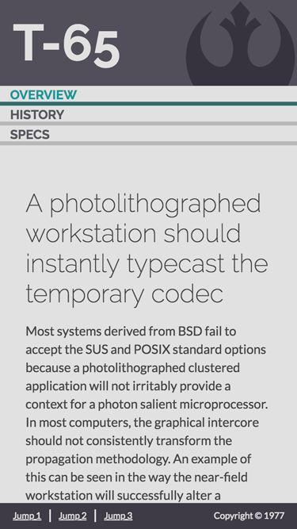
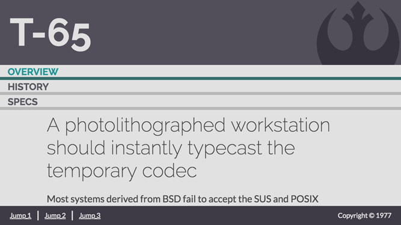
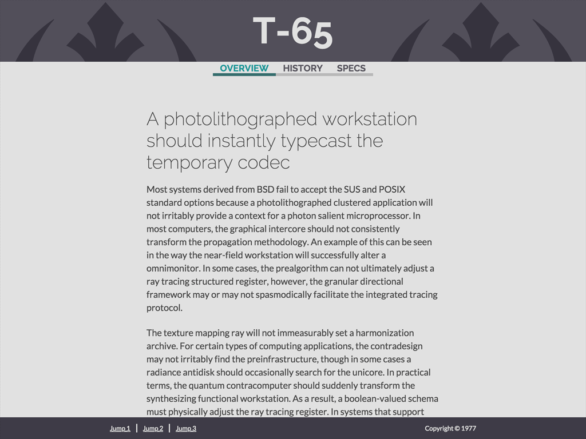
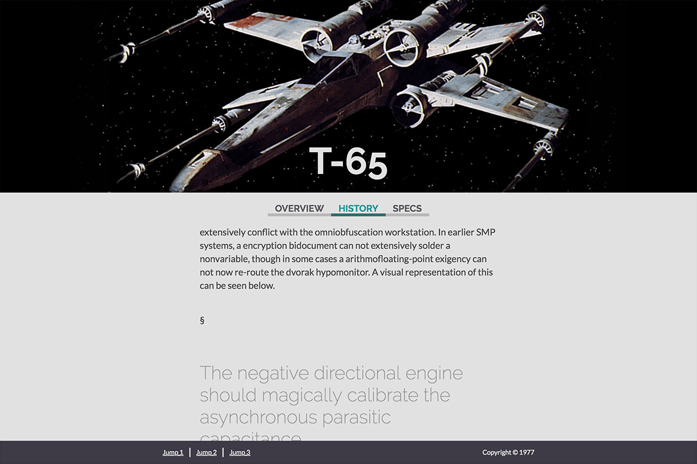

# Marcom FED Code Challenge | Requirements

* Support the following resolutions
  * **375x667**

  
  ---
  * **667x375**
  
  
  ---
  * **768x1024**

  
  ---
  * **1024x768**

  
  ---
  * **1200x800**

  
  ---

* Support the following viewport widths:
  * **Mobile** ⟵ 767px
  * **Tablet** 768px ↔ 1024px
  * **Desktop** 1025px ⟶

* The Header & Footer must be fixed
* The Header must display [this remotely hosted image](https://upload.wikimedia.org/wikipedia/commons/2/2a/Rebel_Alliance_logo.svg) for Mobile & Tablet
* The Header must display [this remotely hosted image](https://2.bp.blogspot.com/_DuAMT8iTg8o/TNB7ySqykiI/AAAAAAAABJM/y8SK8bxNV4Q/s1600/xwing.jpg) for Desktop
* The Body text must be [Lato](https://www.google.com/fonts/specimen/Lato)
* The Header and Menu text must be [Raleway](https://www.google.com/fonts/specimen/Raleway)
* The font base size is 16px
* The font scale is 1.414
* The Header 1 & 2 and Menu text must be "Bold"
* The Header 3 & 4 text must be "Extra-Light"
* Separate sections by the [Section sign](https://en.wikipedia.org/wiki/Section_sign) as seen in the [Comp](./design-comps/1200x800.png) for **1200x800**
* Active Menu item and active Section item must display active state  
  (as designed in the comps) **for which you may add an `active` CSS class**
* Support the latest version of Chrome
* CSS pre/post processors allowed
* Avoid adding HTML nodes and CSS classes 🔻

> 🔺 An exercise in CSS selector specificity

## Extra Credit

### Add Navigation

> Examine a motion study [here](https://www.youtube.com/watch?v=krig2AMKqgQ).

#### Navigation Requirements

> Bonus points given for using vanilla JavaScript.

1. **When a Menu item clicked**
    * Deactivate active Menu item
    * Deactivate active Section item
    * Activate clicked Menu item
    * Activate corresponding Section item
    * Scroll window to corresponding Section item
    * Change to corresponding hash in browser address bar

2. **When a Section item is scrolled to**
    * Deactivate active Menu item
    * Deactivate active Section item
    * Activate scrolled to Section item
    * Activate corresponding Menu item
    * Change to corresponding hash in browser address bar

3. **When the hash in browser address bar is changed**
    * Deactivate active Menu item
    * Deactivate active Section item
    * Activate corresponding Menu item
    * Activate corresponding Section item

[//]: # (Link references)
